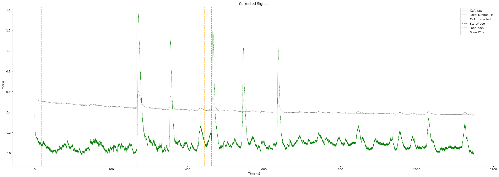
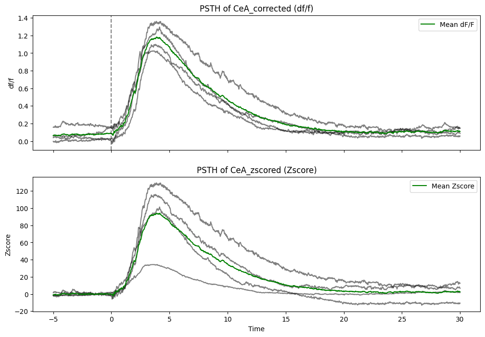

# CeA Fiber Photometry Analysis Example

This page is the fixed, source-visible version of [`ExampleProcessing.ipynb`](ExampleProcessing.ipynb). It demonstrates the complete analysis workflow for a DORIC fiber photometry recording:

1. Load a `.csv` or `.doric` recording.
2. Inspect the imported data.
3. Detect behavioral or stimulus events from digital input channels.
4. Select and rename the CeA fluorescence channel.
5. Remove incomplete rows.
6. Apply photobleaching correction, normalization, trial extraction, and z-scoring.

The example uses **CeA** throughout. Replace the placeholder input path and channel names with the values from your own recording.

## Setup

Create the shared environment from the repository root:

```bash
conda env create -f environment.yml
conda activate STAR_Env
```

## 1. Load the DORIC recording

```python
from Preprocess import ProcessData
import pandas as pd
from doric_system_file import DoricCSV, DoricDORIC
```

Set the path to your recording. The path below is intentionally a public placeholder and contains no machine-specific information.

```python
filepath = r"Path\to\your\file.csv"

if filepath.lower().endswith(".csv"):
    file_opener = DoricCSV()
    file_opener.open_file(filepath)
elif filepath.lower().endswith(".doric"):
    file_opener = DoricDORIC()
    file_opener.open_file(filepath)
else:
    raise ValueError("Unsupported file type. Please provide a .csv or .doric file.")

Data = file_opener.data
print("File type:", filepath.split(".")[-1].lower())
print("Metadata:")
print(getattr(file_opener, "metaData", None))
```

For a CSV file that has already been exported and cleaned, the equivalent direct import is:

```python
Data = pd.read_csv(filepath, skiprows=1).set_index("Time(s)")
```

## 2. Inspect the imported data

```python
Data.head()
```

Confirm that the time index, fluorescence channel, and digital input channels are present before continuing.

## 3. Detect behavioral or stimulus events

The following code detects rising edges in three digital input channels and stores their timestamps.

```python
availableDIO = ["DI/O-1", "DI/O-2", "DI/O-3"]
DIO_names = {
    "DIO01": "StartVideo",
    "DIO02": "FootShock",
    "DIO03": "SoundCue",
}

EventStart = {}
dios = []
for i, dio in enumerate(availableDIO):
    event_name = DIO_names.get(f"DIO{str(i + 1).zfill(2)}", dio)
    dio_events = Data[Data[dio].diff() == 1].index
    EventStart[event_name] = dio_events.tolist()
    dios.append(event_name)

Data.rename(
    columns={
        dio: DIO_names.get(f"DIO{str(i + 1).zfill(2)}", dio)
        for i, dio in enumerate(availableDIO)
    },
    inplace=True,
)
```

## 4. Select the CeA fluorescence channel

Update the source column name if your DORIC export uses a different name.

```python
Signals = ["CeA_raw"]
Data.rename(columns={"AIn-1 - Dem (AOut-1)": "CeA_raw"}, inplace=True)
```

## 5. Clean the dataset

```python
Data = Data.dropna(subset=Signals)[Signals + dios]
```

## 6. Run the preprocessing pipeline

This step applies local-minimum photobleaching correction, optional smoothing and normalization, event-aligned trial extraction, and baseline z-scoring. The call below generates the analysis figures when `plots=True`.

```python
Preprocessed = ProcessData(
    Data,
    Signals,
    EventStart,
    plots=True,
    PSTH_window=[5, 30],
    ZscoreWind=[-2.5, 0],
    Savgol=True,
    LowPassFilter=False,
    eventColor={
        "StartVideo": "blue",
        "FootShock": "red",
        "SoundCue": "orange",
    },
    signals_colors=["green"],
    NormQuantile=True,
    savgolLong=False,
)
```

The returned tuple contains:

```python
Corrected_signals, trialsDataset, zscoredDataset, rolling_median, Unprocessed = Preprocessed
```

- `Corrected_signals`: corrected CeA signal
- `trialsDataset`: event-aligned CeA trials
- `zscoredDataset`: baseline-normalized CeA trials
- `rolling_median`: rolling median when median filtering is enabled
- `Unprocessed`: optional unprocessed signal output

### Example output: corrected signal

The corrected CeA trace is shown with the fitted photobleaching trend and event markers.



### Example output: FootShock-aligned responses

The FootShock-aligned trials are shown as dF/F and baseline z-score PSTHs.



## Save the processed outputs

```python
from Preprocess import SavePreprocess

SavePreprocess(
    output_directory="output_folder",
    AnimalID="Animal_01",
    Corrected_signals=Preprocessed[0],
    trialsDataset=Preprocessed[1],
    zscoredDataset=Preprocessed[2],
    rolling_median=Preprocessed[3],
)
```

The outputs include corrected signals as `.npy` data and event-specific trial and z-score tables as `.csv` files.

## Notes

- Use a local path to your own DORIC recording; do not commit raw recordings unless they are approved for public release.
- Check the fluorescence and digital input column names against `Data.head()` before running the pipeline.
- Adjust `PSTH_window` and `ZscoreWind` to match the experimental design.
- The notebook version includes the same workflow and can be used to generate the figures interactively.

## Related files

- [`ExampleProcessing.ipynb`](ExampleProcessing.ipynb)
- [`Preprocess.py`](Preprocess.py)
- [`doric_system_file.py`](doric_system_file.py)
- [`photobleaching_correctors.py`](photobleaching_correctors.py)
- [`trials_extraction.py`](trials_extraction.py)
- [`custom_Zscore.py`](custom_Zscore.py)
